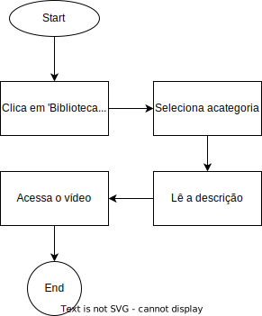
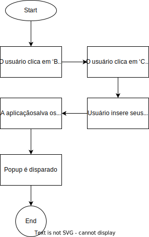
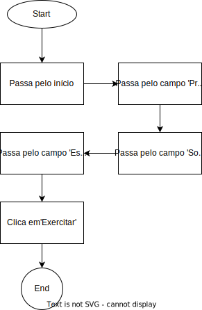
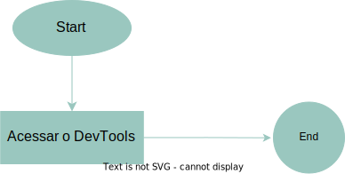
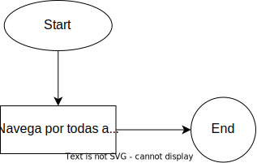
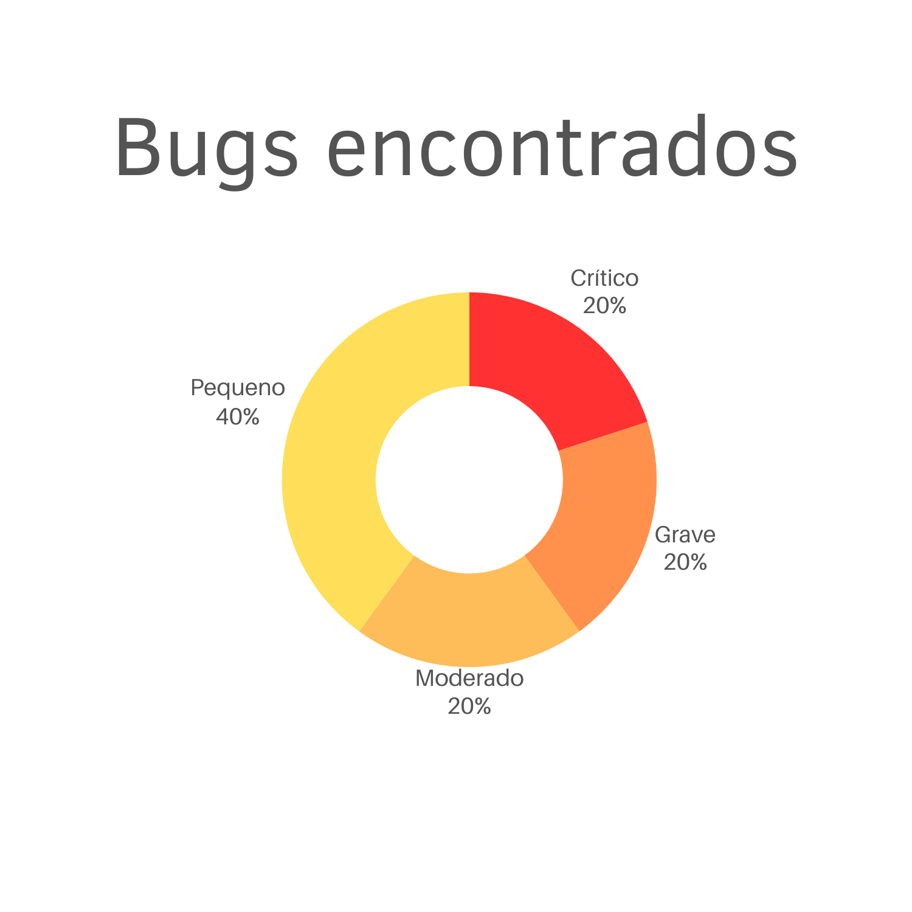

# Testes

Neste projeto serão realizados dois tipos de testes:

 - O **Teste de Software**, que utiliza uma abordadem de caixa preta, e tem por objetivo verificar a conformidade do software com os requisitos funcionais e não funcionais do sistema.
 - O **Teste de Usabilidade**, que busca avaliar a qualidade do uso do sistema por um usuário do público alvo. 

A documentação dos testes é dividida nas seguintes seções:

 - [Plano de Testes de Software](#plano-de-testes-de-software)
 - [Registro dos Testes de Software](#registro-dos-testes-de-software)
 - [Avaliação dos Testes de Software](#avaliação-dos-testes-de-software)
 - [Cenários de Teste de Usabilidade](#cenários-de-teste-de-usabilidade)
 - [Registro dos Testes de Usabilidade](#registro-de-testes-de-usabilidade)
 - [Avaliação dos Testes de Usabilidade](#avaliação-dos-testes-de-usabilidade)

# Teste de Software

Atualmente, temos as intenções de rastrear os bugs presentes nas aplicações por meio do plano de teste citado abaixo. No entanto, é de nossa responsabilidade categorizar os tipos de bugs, para que assim, possamos compreender o nível de severidade e importância que devemos dar para cada bug, segue abaixo as categorias usadas:

- Severidade
    1. S1 - Crítica / Show Stopper: bloqueia o uso da aplicação;
    2. S2 - Grave: bugs que causam erros indesejados e geralmente irreversíveis;
    3. S3 - Moderada: a funcionalidade não atinge os critérios esperados, mas ainda é utilizável;
    3. S4 - Pequena: impacto minímo na aplicação, como erros na interface gráfica.

## Plano de Testes de Software

### Caso de Teste 001

**Caso de Teste** | **CT01 - Acessar os exercícios**
 :--------------: | ------------
**Procedimento**  | 1) O usuário acessa a url https://icei-puc-minas-pmv-si.github.io/pmv-si-2023-2-pe1-t2-senectus/src/home e começa a navegar por cada campo   2) Após terminar de navegar pela página inícial, o usuário clica em 'Exercitar'   3) Seleciona a categoria de seu interesse   4) Usuário lê a descrição do exercício em questão e acessa o vídeo do exercício pelo youtube
**Requisitos associados** | RF-001, RF-002, RF-003, RF-004, RF-011, RF-012, RF-013, RNF-004
**Resultado esperado** | Viabilizar o acesso do usuário aos vídeos feitos para os instruir na sua rotina de exercícios
**Dados de entrada** | A url da página inicial
**Resultados obtidos**    | SUCESSO |
**Bugs encontrados** | 0 |
**Bugs corrigidos** | 0 |
**Páginas acessadas** | 1) https://icei-puc-minas-pmv-si.github.io/pmv-si-2023-2-pe1-t2-senectus/src/home   2) https://icei-puc-minas-pmv-si.github.io/pmv-si-2023-2-pe1-t2-senectus/src/exercises-types   3) https://icei-puc-minas-pmv-si.github.io/pmv-si-2023-2-pe1-t2-senectus/src/exercises-list-hipertrofia.html |

 

### Fluxograma do teste - CT01

    

 
 
 
 

### Caso de Teste 002

**Caso de Teste** | **CT02 - Criar conta completa**
 :--------------: | ------------
**Procedimento**  | 1) O usuário acessa a url https://icei-puc-minas-pmv-si.github.io/pmv-si-2023-2-pe1-t2-senectus/src/home   2) O usuário clica em 'Entrar como profissional'   3) O usuário clica em 'clique aqui' para acessar a página de criação de conta   4) Usuário insere seu nome, email e senha   5) A aplicação valida os dados, verificando se possui os requisitos necessários para serem armazenados corretamente   6) Se tudo estiver correto, o sistema deve embaralhar os dados em formato hexadecimal   7) O sistema, após embaralhar o conteúdo, armazena no Local Storage e gera um token de autenticação, armazenando-o no Session Storage   8) O usuário é redirecionado para a home, mas desta vez, autenticado   9) O sistema o pede para completar seu perfil e o redireciona para a url https://icei-puc-minas-pmv-si.github.io/pmv-si-2023-2-pe1-t2-senectus/src/configs   10) Usuário preenche dados mais completos
**Requisitos associados** | RF-005, RF-006, RF-018, RNF-003, RNF-006
**Resultado esperado** | Criação de conta por completo
**Dados de entrada** | A url da página inicial, a inserção de dados válidos no formulário de cadastro e de configurações da conta.
**Resultados obtidos**    | SUCESSO |
**Bugs encontrados** | 1 |
**Bugs corrigidos** | 1 |
**Descrição dos bugs**| 1) S1 - Popup na qual solicita o preenchimento de dados relacionados aos contatos do usuário disparava em todas as páginas, incluindo a de configuração e de maneira incessante   2) S4 - O mesmo popup é disparado instantaneamente, impossibilitando a visualização da tela do usuário de início, o que não é nossa intenção.
**Branches de correções** | [7d20231](https://github.com/ICEI-PUC-Minas-PMV-SI/pmv-si-2023-2-pe1-t2-senectus/commit/7d20231fd23a94966f0211bb74f523e354fae214), [33f2866](https://github.com/ICEI-PUC-Minas-PMV-SI/pmv-si-2023-2-pe1-t2-senectus/commit/33f28663e91d2840ffcbd916d1a53d4d0cc38475), [39d97e6](https://github.com/ICEI-PUC-Minas-PMV-SI/pmv-si-2023-2-pe1-t2-senectus/commit/39d97e60a4ce69fef483bb695d0c1d5fc78f4bff) |
**Páginas acessadas** | 1) https://icei-puc-minas-pmv-si.github.io/pmv-si-2023-2-pe1-t2-senectus/src/home   2) https://icei-puc-minas-pmv-si.github.io/pmv-si-2023-2-pe1-t2-senectus/src/cadastro   3) https://icei-puc-minas-pmv-si.github.io/pmv-si-2023-2-pe1-t2-senectus/src/configs |

 

### Fluxograma do teste - CT02

    

 
 
 
 

### Caso de Teste 003

**Caso de Teste** | **CT03 - Configuração da conta**
 :--------------: | ------------
**Procedimento**  | 1) O usuário acessa a url https://icei-puc-minas-pmv-si.github.io/pmv-si-2023-2-pe1-t2-senectus/src/home   2) O usuário clica em 'Bem-vindo \<NOME\>'   3) O usuário clica em 'Configurações'   4) Usuário tenta inserir dados novos na sua conta por meio do formulário fornecido   5) A aplicação atualiza os dados armazenados no Local Storage e o token armazenado em Session Storage   6) A aplicação dispara um popup alertando que a conta foi atualizada
**Requisitos associados** | RF-014, RF-018
**Resultado esperado** | Atualização da conta
**Dados de entrada** | A url da página inicial e a inserção de dados válidos no formulário de atualização dos dados na página de configuração.
**Resultados obtidos**    | SUCESSO |
**Bugs encontrados** | 1 |
**Bugs corrigidos** | 1 |
**Descrição dos bugs**| 1) S4 - O campo de cidade não tem a funcionalidade de sugestões de cidades existentes, caso o usuário não mude o estado. |
**Branches de correções** | [d3c5032](https://github.com/ICEI-PUC-Minas-PMV-SI/pmv-si-2023-2-pe1-t2-senectus/commit/d3c50326abb8d2ffb6bffcf9f3daeb6c1ebcc59b) |
**Páginas acessadas** | 1) https://icei-puc-minas-pmv-si.github.io/pmv-si-2023-2-pe1-t2-senectus/src/home   2) https://icei-puc-minas-pmv-si.github.io/pmv-si-2023-2-pe1-t2-senectus/src/configs |

### Fluxograma do teste - CT03

    

 
 
 
 

### Caso de Teste 004

**Caso de Teste** | **CT04 - Login da conta**
 :--------------: | ------------
**Procedimento**  | 1) O usuário acessa a url https://icei-puc-minas-pmv-si.github.io/pmv-si-2023-2-pe1-t2-senectus/src/home   2) O usuário clica em 'Entrar como profissional'   3) Usuário insere seu email e senha   4) A aplicação verifica se o usuário existe, caso exista, o mesmo é redirecionado para a home já autenticado e com posse do token no Session Storage
**Requisitos associados** | RF-007, RNF-003
**Resultado esperado** | Login da conta e redirecionamento para a home
**Dados de entrada** | A url da página inicial e a inserção de dados válidos no formulário de login.
**Resultados obtidos**    | SUCESSO |
**Bugs encontrados** | 0 |
**Bugs corrigidos** | 0 |
**Páginas acessadas** | 1) https://icei-puc-minas-pmv-si.github.io/pmv-si-2023-2-pe1-t2-senectus/src/home   2) https://icei-puc-minas-pmv-si.github.io/pmv-si-2023-2-pe1-t2-senectus/src/login |

### Fluxograma do teste - CT04

    

 
 
 
 

### Caso de Teste 005

**Caso de Teste** | **CT05 - Buscar profissional**
 :--------------: | ------------
**Procedimento**  | 1) O usuário acessa a url https://icei-puc-minas-pmv-si.github.io/pmv-si-2023-2-pe1-t2-senectus/src/home   2) Usuário filtra os profissionais por fisioterapeuta   2) Usuário insere o nome do profissional que deseja contatar   3) Usuário clica em contatar e escolhe o meio de contato na qual deseja utilizar
**Requisitos associados** | RF-008, RF-009, RF-010, RF-016, RF-017, RNF-004
**Resultado esperado** | Usuário contata um profissional de seu desejo
**Dados de entrada** | A url da página inicial e a inserção do nome do profissional e a categoria do mesmo
**Resultados obtidos**    | SUCESSO |
**Bugs encontrados** | 2 |
**Bugs corrigidos** | 2 |
**Descrição dos bugs**| 1) S2 - Percebe-se um bug na pesquisa dos profissionais por palavra-chave, onde o sistema limitava a iteração de usuário no Local Storage até o máximo de 12 usuário   2) S3 - Ao tentar filtrar por profissionais e palavra-chave ao mesmo tempo, o aplicativo retorna dados incorretos |
**Branches de correções** | [9eeff33](https://github.com/ICEI-PUC-Minas-PMV-SI/pmv-si-2023-2-pe1-t2-senectus/commit/9eeff330b55bef1146946dc46a6a7e10a480fcd1), [6234d87](https://github.com/ICEI-PUC-Minas-PMV-SI/pmv-si-2023-2-pe1-t2-senectus/tree/6234d876d2a535010b68f1d2889de3d314b624ce) |
**Páginas acessadas** | 1) https://icei-puc-minas-pmv-si.github.io/pmv-si-2023-2-pe1-t2-senectus/src/home   2) https://icei-puc-minas-pmv-si.github.io/pmv-si-2023-2-pe1-t2-senectus/src/search-professionals |

### Fluxograma do teste - CT05

    

 
 
 
 

### Caso de Teste 006

**Caso de Teste** | **CT06 - Deletar conta**
 :--------------: | ------------
**Procedimento**  | 1) O usuário acessa https://icei-puc-minas-pmv-si.github.io/pmv-si-2023-2-pe1-t2-senectus/src/home   2) O usuário clica em 'Bem-vindo \<NOME\>'   3) O usuário clica em 'Configurações'   4) Usuário clica em 'Deletar conta'   5) A aplicação deleta a conta e remove seu token   6) A aplicação dispara um popup alertando que a conta foi deletada   7) Sistema redireciona para a página inicial
**Requisitos associados** | RF-015
**Resultado esperado** | Deleção da conta
**Dados de entrada** | A url da página inicial | 
**Resultados obtidos**    | SUCESSO |
**Bugs encontrados** | 0 |
**Bugs corrigidos** | 0 |
**Páginas acessadas** | 1) https://icei-puc-minas-pmv-si.github.io/pmv-si-2023-2-pe1-t2-senectus/src/home   2) https://icei-puc-minas-pmv-si.github.io/pmv-si-2023-2-pe1-t2-senectus/src/configs |

### Fluxograma do teste - CT06

    

 
 
 
 

### Caso de Teste 007
**Caso de Teste** | **CT07 - Javascript**
:---------------: | ---------------------
**Procedimento**  | 1) Acessar o DevTools do navegador e acessar o Javascript
**Requisitos associados** | RNF-005
**Resultados esperados** | Encontrar arquivos Javascript no sistema
**Dados de entrada** | A url da página inicial | 
**Resultados obtidos**    | SUCESSO |
**Bugs encontrados** | 0 |
**Bugs corrigidos** | 0 |
**Páginas acessadas** | 1) https://icei-puc-minas-pmv-si.github.io/pmv-si-2023-2-pe1-t2-senectus/src/home |

### Fluxograma do teste - CT07

    

 
 
 
 

### Caso de Teste 008
**Caso de Teste** | **CT08 - Responsividade no mobile**
:---------------: | ---------------------
**Procedimento**  | 1) Navegar pelo site
**Requisitos associados** | RNF-002
**Resultados esperados** | Assim como nos testes que envolvem o site em dispositivos desktop, como mostrados nos demais casos, espera-se que o projeto seja responsivo para dispositivos mobile também |
**Dados de entrada** | A url da página inicial | 
**Resultados obtidos**    | SUCESSO |
**Bugs encontrados** | 0 |
**Bugs corrigidos** | 0 |
**Páginas acessadas** | Todos as páginas |

### Fluxograma do teste - CT08

    

 
 
 
 

### Caso de Teste 009
**Caso de Teste** | **CT09 - Desconexão/Logout**
:---------------: | ---------------------
**Procedimento**  | 1) O usuário acessa https://icei-puc-minas-pmv-si.github.io/pmv-si-2023-2-pe1-t2-senectus/src/home   2) O usuário clica em 'Bem-vindo \<NOME\>'   3) O usuário clica em 'Desconectar'   4) O sistema remove seu token de autenticação e redireciona o usuário para a página de login
**Requisitos associados** | RF-019, RNF-003 
**Resultados esperados** | A desconexão do usuário |
**Dados de entrada** | A url da página inicial | 
**Resultados obtidos**    | SUCESSO |
**Páginas acessadas** | 1) https://icei-puc-minas-pmv-si.github.io/pmv-si-2023-2-pe1-t2-senectus/src/home   2) https://icei-puc-minas-pmv-si.github.io/pmv-si-2023-2-pe1-t2-senectus/src/login |

### Fluxograma do teste - CT09

    

 
 
 
 

### Caso de Teste 010
**Caso de Teste** | **CT10 - Usabilidade**
:---------------: | ---------------------
**Procedimento**  | 1) Acessar a aplicação em https://icei-puc-minas-pmv-si.github.io/pmv-si-2023-2-pe1-t2-senectus/src/home   2) Validar com base nas Heurísticas de Nielsen
**Requisitos associados** | RNF-001, RNF-004
**Resultados esperados** | O sistema estar seguindo pelo menos 4 heurísticas 
**Resultados obtidos**    | SUCESSO |
**Heurísticas encontradas** | 1) Compatibilidade entre o sistema e o mundo real   2) Consistência e Padronização   3) Prevenção de erros   4) Diagnóstico de erros   5) Design minimalista
**Páginas acessadas** | 1) https://icei-puc-minas-pmv-si.github.io/pmv-si-2023-2-pe1-t2-senectus/src/home |

 
 
 
 

## Registro dos Testes de Software
|*Caso de Teste*    |*TC-01 - Acessar os exercícios* |
|---|---|
|Requisito Associado | RF-001 - O sistema deve permitir que usuários tenham acesso a descrição informativa de exercícios.   RF-002 - O sistema deve permitir que usuários sejam capazes de acessar o catálogo de exercícios e os selecionar.   RF-011 - O sistema deve ter uma página inicial que mostre a importância da atividade física durante o envelhecimento.   RF-012 - O sistema deve ter uma página inicial que fale sobre a iniciativa do projeto Senectus.   RF-013 - O sistema deve ter uma página inicial que mostre o quão confiável a plataforma é.   RF-003 O sistema deve permitir a seleção de exercícios em forma de categórias.   RF-004 O sistema deve permitir que o usuário tenha acesso a algum vídeo ou imagem sobre como fazer o exercício.   RNF-004 - O sistema deve ser de fácil entendimento para o público idoso |
|Link do vídeo do teste realizado: | [CT01 - Video](https://github.com/ICEI-PUC-Minas-PMV-SI/pmv-si-2023-2-pe1-t2-senectus/assets/92616145/3a737020-20b3-40ab-9902-395856c831ba)  | 

|*Caso de Teste*                                 |*TC-02 - Criar conta completa*                                         |
|---|---|
|Requisito Associado | RF-005 - O sistema deve permitir que um profissional se cadastre na plataforma, inserindo informações básicas.   RNF-006 - O sistema deve respeitar as normas da LGPD   RF-006 - O sistema deve permitir que os profissionais sejam capazes de preencher informações mais completas sobre suas competências logo após o cadastro.   RF-018 - O sistema deve permitir que usuários profissionais definam previamente o valor de seus serviços   RNF-003 - O sistema deve seguir boas práticas de segurança da informação sempre que possível|
|Link do vídeo do teste realizado: | [CT02 - Video](https://github.com/ICEI-PUC-Minas-PMV-SI/pmv-si-2023-2-pe1-t2-senectus/assets/92616145/fdcd15d9-b290-4b79-bca6-18593419459c) |
|Nota: | É mais que válido lembrar que a partir do momento em que os dados do usuário são obtidos, a aplicação, aplica uma camada extra de proteção dos dados, utilizando a classe presente em '/src/js/utils/obfuscator.js' na camada de repositório. Além disso, todas as ações e manipulações realizadas pela aplicação, como o compartilhamento dos dados obtidos para a base de clientes, só serão realizadas, caso o usuário aceite e insira seus devidos meios de contatos, conforme mostrado no vídeo. |

|*Caso de Teste*                                 |*TC-03 - Configuração da conta*                                         |
|---|---|
|Requisito Associado | RF-014 - O sistema deve permitir que usuários profissionais atualizem seus perfis.   RF-018 - O sistema deve permitir que usuários profissionais definam previamente o valor de seus serviços. |
|Link do vídeo do teste realizado: | [CT03 - Video](https://github.com/ICEI-PUC-Minas-PMV-SI/pmv-si-2023-2-pe1-t2-senectus/assets/92616145/cc3b035e-c278-46ac-93bc-16dcd1f0f529)  | 

|*Caso de Teste*                                 |*TC-04 - Login da conta*                                         |
|---|---|
|Requisito Associado | RF-007 - O sistema deve permitir que usuários profissionais, previamente cadastrados, façam login na aplicação.   RNF-003 - O sistema deve seguir boas práticas de segurança da informação sempre que possível. |
|Link do vídeo do teste realizado: | [CT04 - Video](https://github.com/ICEI-PUC-Minas-PMV-SI/pmv-si-2023-2-pe1-t2-senectus/assets/92616145/134f2ef3-31fd-4138-aa8f-bd816c201c5a) |

|*Caso de Teste*                                 |*TC-05 - Buscar profissional*                                         |
|---|---|
|Requisito Associado | RF-008 - O sistema deve permitir que usuários contactem profissionais.   RF-009 - O sistema deve ser capaz de filtrar profissionais por especialidade.   RF-010 - O sistema deve ser capaz de filtrar profissionais por palavra-chave.   RF-016 - O sistema deve permitir que o usuário idoso marque uma consulta com o profissional da saúde.   RF-017 - O sistema deve permitir que o usuário profissional receba uma notificação no seu e-mail para confirmação de consulta.   RNF-004 - O sistema deve ser de fácil entendimento para o público idoso |
|Link do vídeo do teste realizado: | [CT05 - Video](https://github.com/ICEI-PUC-Minas-PMV-SI/pmv-si-2023-2-pe1-t2-senectus/assets/92616145/cccb14b5-4be0-4525-a8b4-28b4d0590ec6) |

|*Caso de Teste*                                 |*TC-06 - Deletar conta*                                         |
|---|---|
|Requisito Associado | RF-015 - O sistema deve permitir que o usuário profissional seja capaz de deletar a sua conta. |
|Link do vídeo do teste realizado: | [CT06 - Video](https://github.com/ICEI-PUC-Minas-PMV-SI/pmv-si-2023-2-pe1-t2-senectus/assets/92616145/b2666163-7d20-419b-94df-229580d3f19e) |

|*Caso de Teste*                                 |*TC-07 - Utilização do Javascript*                                         |
|---|---|
|Requisito Associado | RNF-005 - O sistema deve ser desenvolvido utilizando a linguagem de programação Javascript |
|Link do vídeo do teste realizado: | [CT07 - Video](https://github.com/ICEI-PUC-Minas-PMV-SI/pmv-si-2023-2-pe1-t2-senectus/assets/92616145/3cbd9db9-afa5-41d0-98ca-c6d8966bb3da) |
|Explicação da arquitetura do projeto em javascript: | [development.md](development.md#estrutura-do-projeto) |

|*Caso de Teste*                                 |*TC-08 - Responsividade*                                         |
|---|---|
|Requisito Associado | RNF-002 - O sistema deve ser responsivo em diversas telas com base no público-alvo |
|Link do vídeo do teste realizado: |  [CT08 - Video](https://github.com/ICEI-PUC-Minas-PMV-SI/pmv-si-2023-2-pe1-t2-senectus/assets/92616145/673f9ba4-e0d5-4ec2-bd8b-8cbfa00f376f) |

|*Caso de Teste*                                 |*TC-09 - Desconexão/Logout*                                         |
|---|---|
|Requisito Associado | RNF-019 - O sistema deve permitir que usuários desloguem da plataforma |
|Link do vídeo do teste realizado: |  [CT09 - Video](https://github.com/ICEI-PUC-Minas-PMV-SI/pmv-si-2023-2-pe1-t2-senectus/assets/92616145/8397d5a4-9a23-4ddc-9628-7e860bb7775e) |

|*Caso de Teste*                                 |*TC-10 - Usabilidade*                                         |
|---|---|
|Requisito Associado | RNF-001 - O sistema deve seguir boas práticas de desenvolvimento de sistemas com relação a usabilidade.   RNF-004 - O sistema deve ser de fácil entendimento para o público idoso. |
|Link dos documentos: |  [Documento de comprovação](https://github.com/ICEI-PUC-Minas-PMV-SI/pmv-si-2023-2-pe1-t2-senectus/files/13625094/heuristicas.pdf) |

## Avaliação dos Testes de Software

### Sobre os bugs
Ao terminar os testes de software, foi possível encontrar alguns bugs de diversos níveis, desde o mais grave até o mais simples. No entanto, é válido ressaltar que todos os bugs detectados na aplicação atualmente, com base nos testes, foram corrigidos com sucesso, somando assim 5 correções de 5 bugs, segue abaixo o gráfico que separa os bugs pelas suas devidas categorias:

    

 

Vale destacar que, a detecção dos bugs foram de extrema importância para o desenvolvimento do projeto, tendo em vista de que foi possível gerar um feedback de como está o estado de vida da aplicação e propor possíveis melhorias, como a adição de um tempo de espera nos disparos de popups referentes ao CT02.

### Pontos fracos e fortes da aplicação 

Ao analisar a aplicação por meios dos testes foi possível compreender onde a aplicação mais se destaca e onde ela menos se destaca, por exemplo, como analisado no CT10 a aplicação possui fortes pontos positivos com relação ao seu layout, sendo minimalista, direto ao ponto e eficiente, quando o assunto é feedback e validação dos dados de entrada que o usuário pode interagir, impedindo assim, que o mesmo cometa erros básicos no sistema.

No entanto, pelo fato da aplicação se tratar de um modelo MVP (Minimum Viable Product), podem-se notar limitações significativas em suas funcionalidades, como por exemplo, poucos exercícios presentes em sua biblioteca e poucas funcionalidades dedicadas para os profissionais que se cadastrem na aplicação.

# Testes de Usabilidade

O objetivo do Plano de Testes de Usabilidade é obter informações quanto à expectativa dos usuários em relação à funcionalidade da aplicação. Objetivando respeitar as diretrizes da Lei Geral de Proteção de Dados (LGPD), as informações pessoais dos usuários que participaram do teste não foram coletadas.

Para este teste de usabilidade, elaboramos cinco cenários, cada um baseado na definição apresentada sobre as histórias dos usuários definido na etapa das especificações do projeto.

Foram convidadas 6 pessoas que os perfis se encaixassem nas definições das personas apresentadas na documentação, sendo, idosos e profissionais da saúde; visando averiguar os seguintes indicadores:

### Indicadores 

**Taxa de sucesso:** Métrica coletada a respeito do cumprimento de uma tarefa passada ao usuário, se o usuário conseguiu ou não executar a tarefa proposta;

**Satisfação subjetiva:** Métrica coletada a respeito da avaliação subjetiva por parte do usuário à tarefa proposta, como o usuário avalia o sistema com relação à execução da tarefa proposta, conforme a seguinte escala:

1. Péssimo; 
2. Ruim; 
3. Regular; 
4. Bom; 
5. Ótimo.

**Tempo para conclusão da tarefa:** em segundos e minutos, e em comparação com o tempo utilizado quando um especialista (um desenvolvedor) realiza a mesma tarefa.

## Cenários de Teste de Usabilidade

| Nº do Cenário | Descrição do cenário |
|---------------|----------------------|
| 1             | Você é uma pessoa que se encaixa na meia idade e sedentária. Acesse a página inicial do site e tente compreender a proposta do projeto. Incluindo a importância da atividade física durante o envelhecimento, sobre o que é o nosso projeto e a segurança dos seus dados na nossa plataforma. |
| 2             | Você é uma pessoa que se encaixa na meia idade e sedentária que está procurando conhecer novos tipos de exercícios físicos da categoria aeróbico e pretende obter conteúdos digitais que conseguem te guiar passo a passo nos seus exercícios. Encontre a atividade física que se encaixa nesta categoria no site. |
| 3             | Você é uma pessoa que se encaixa na meia idade e sedentária que está procurando contatos de profissionais da saúde relacionados à fisioterapia. Procure os contatos de fisiterapeutas na sua cidade. |
| 4             | Você é um profissional da saúde buscando uma plataforma que divulgue os seus meios de contatos. Encontre uma maneira de vincular ao Senectus criando a sua própria conta para se divulgar e, logo em seguida, se desconecte da plataforma de maneira segura. |
| 5             | Você é um profissional da saúde na qual deixou de usar a plataforma Senectus e quer se desvincular ao site. Encontre uma maneira de remover seus dados. |

## Registro de Testes de Usabilidade

### Registro indiscriminado
Referente ao registro sem a devida separação de grupos

Cenário 1: Você é uma pessoa que se encaixa na meia idade e sedentária. Acesse a página inicial do site e tente compreender a proposta do projeto. Incluindo a importância da atividade física durante o envelhecimento, sobre o que é o nosso projeto e a segurança dos seus dados na nossa plataforma.

| Usuário | Taxa de sucesso | Satisfação subjetiva | Tempo para conclusão do cenário |
|---------|-----------------|----------------------|---------------------------------|
| 1       | SIM             | 5                    | 1:30 minutos                  |
| 2       | SIM             | 5                    | 46 segundos             |
| 3       | SIM             | 5                    | 2:34 minutos                  |
| 4       | SIM             | 5                    | 2:52 minutos                  |
| 5       | SIM             | 5                    | 2:31 minutos                  |
| **Média**     | 100%           | 5                | 2:06 minutos                           |
| **Tempo para conclusão pelo especialista** | SIM | 5 | 37.61 segundos |

    Comentários dos usuários: 
        - Achei tudo muito bem explicado, 
          me convenceria rápido!

Cenário 2: Você é uma pessoa que se encaixa na meia idade e sedentária que esta procurando conhecer novos tipos exercícios físico da categória aeróbico e pretende obter conteúdos digitais que conseguem te guiar passo a passo nos seus exercícios. Encontre a atividade física que se encaixa nesta categoria no site. Além do mais descreva em voz alta um exercício que lhe gerou interesse e selecione a categoria.

| Usuário | Taxa de sucesso | Satisfação subjetiva | Tempo para conclusão do cenário |
|---------|-----------------|----------------------|---------------------------------|
| 1       | SIM             | 5                    | 0:24 segundos                  |
| 2       | SIM             | 5                    | 1:05 minutos                  |
| 3       | SIM             | 5                    | 1:32 minutos                   |
| 4       | SIM             | 5                    | 1:08 minutos              |
| 5       | SIM             | 5                    | 0:44 segundos                   |
| **Média**     | 100%           | 5                | 58.6 segundos                           |
| **Tempo para conclusão pelo especialista** | SIM | 5 | 37.61 segundos |

    Comentários dos usuários: 
        - Achei o site muito bom e fácil 
          de achar as informações.
    

Cenário 3: Você é uma pessoa que se encaixa na meia idade e sedentária que esta procurando contatos de profissionais da saúde relacionados a fisioterapia. Procure os contatos de fisiterapeutas na sua cidade.

| Usuário | Taxa de sucesso | Satisfação subjetiva | Tempo para conclusão do cenário |
|---------|-----------------|----------------------|---------------------------------|
| 1       | SIM             | 3                    | 1:45 minutos                  | 
  2       | SIM             | 3                    | 38.25 segundos              |
  3       | SIM             | 5                    | 3:02 minutos              |
  4       | SIM             | 4                    | 3:21 minutos              |
  5       | SIM             | 5                    | 2:41 minutos              |
  6       | SIM             | 5                    | 2:58 minutos              |
| **Média**     | 100%           | 4.16                | 2:22 minutos                           |
| **Tempo para conclusão pelo especialista** | SIM | 5 | 58.7 segundos |

    Comentários dos usuários:
        - Achei fácil e prático, mas tive 
          dificuldades em encontrar profissionais 
          de saúde do meu interesse.

Cenário 4: Você é um profissional da saúde buscando uma plataforma que divulgue os seus meios de contatos. Encontre uma maneira de vincular ao Senectus criando a sua propria conta para se divulgar e logo em seguida se desconecte da plataforma de maneira segura.

| Usuário | Taxa de sucesso | Satisfação subjetiva | Tempo para conclusão do cenário |
|---------|-----------------|----------------------|---------------------------------|
| 1       | SIM             | 4                    | 3:00 minutos                 |
| 2       | SIM             | 5                    |   6:23.00 minutos               |
| 3       | SIM             | 5                    |   3:22.00 minutos               |
| 4       | SIM             | 4                    |   2:33.00 minutos               |
| 5       | SIM             | 3                    |   3:49.43 minutos               |
| **Média**     | 100%           | 4.2                | 3:49.4 minutos                      |
| **Tempo para conclusão pelo especialista** | SIM | 5 | 47.99 segundos |

    Comentários dos usuários: 
        - Eu tive uma certa dificuldade ao editar meus 
          dados na página de configuração, percebi uma 
          leve quebra na interface ao inserir letras no 
          telefone de contato, mas fora isso achei muito bom.
          
    Nota dos desenvolvedores:
        - Esta quebra no layout já foi corrigida com sucesso!

Cenário 5: Você é um profissional da saúde na qual deixou de usar a plataforma Senectus e quer se desvincular ao site. Encontre uma maneira de remover seus dados.

| Usuário | Taxa de sucesso | Satisfação subjetiva | Tempo para conclusão do cenário |
|---------|-----------------|----------------------|---------------------------------|
| 1       | SIM             | 5                    | 14.4 segundos                          |
| 2       | SIM             | 5                    | 25 segundos                          |
| 3       | SIM             | 5                    | 15.30 segundos                          |
| 4       | SIM             | 5                    | 14.40 segundos                          |
| 5       | SIM             | 5                    | 17.02 segundos                          |
| 6       | SIM             | 5                    | 15.02 segundos                          |
| **Média**     | 100%           | 5                | 16 segundos                           |
| **Tempo para conclusão pelo especialista** | SIM | 5 | 15.92 segundos |

    Comentários dos usuários: 
        - Eu não vi nenhuma dificuldade ao 
          deletar meus dados!

### Registro por grupo - Idoso

Cenário 1: Você é uma pessoa que se encaixa na meia idade e sedentária. Acesse a página inicial do site e tente compreender a proposta do projeto. Incluindo a importância da atividade física durante o envelhecimento, sobre o que é o nosso projeto e a segurança dos seus dados na nossa plataforma.

| Usuário | Taxa de sucesso | Satisfação subjetiva | Tempo para conclusão do cenário |
|---------|-----------------|----------------------|---------------------------------|
| 1       | SIM             | 5                    | 46 segundos             |
| 2       | SIM             | 5                    | 2:52 minutos                  |
| 3       | SIM             | 5                    | 2:31 minutos                  |
| **Média**     | 100%           | 5                | 2:03 minutos                           |
| **Tempo para conclusão pelo especialista** | SIM | 5 | 37.61 segundos |

    Comentários dos usuários do grupo: 
        - Achei tudo muito bem explicado, 
          me convenceria rápido

Cenário 2: Você é uma pessoa que se encaixa na meia idade e sedentária que esta procurando conhecer novos tipos exercícios físico da categória aeróbico e pretende obter conteúdos digitais que conseguem te guiar passo a passo nos seus exercícios. Encontre a atividade física que se encaixa nesta categoria no site. Além do mais descreva em voz alta um exercício que lhe gerou interesse e selecione a categoria.

| Usuário | Taxa de sucesso | Satisfação subjetiva | Tempo para conclusão do cenário |
|---------|-----------------|----------------------|---------------------------------|
| 1       | SIM             | 5                    | 1:05 minutos                  |
| 2       | SIM             | 5                    | 1:08 minutos              |
| 3       | SIM             | 5                    | 0:44 segundos                   |
| **Média**     | 100%           | 5                | 59 segundos                           |
| **Tempo para conclusão pelo especialista** | SIM | 5 | 37.61 segundos |

    Comentários dos usuários: 
        - Achei o site muito bom e fácil 
          de achar as informações.
        - Foi fácil e prático. Gostei 
          especificamente da categoria de aeróico.
        - Achei direto ao ponto e intuitivo

Cenário 3: Você é uma pessoa que se encaixa na meia idade e sedentária que esta procurando contatos de profissionais da saúde relacionados a fisioterapia. Procure os contatos de fisiterapeutas na sua cidade.

| Usuário | Taxa de sucesso | Satisfação subjetiva | Tempo para conclusão do cenário |
|---------|-----------------|----------------------|---------------------------------|
  2       | SIM             | 3                    | 38.25 segundos              |
  4       | SIM             | 4                    | 3:21 minutos              |
  6       | SIM             | 5                    | 2:58 minutos              |
| **Média**     | 100%           | 4                | 2:19 minutos                           |
| **Tempo para conclusão pelo especialista** | SIM | 5 | 58.7 segundos |

    Comentários dos usuários:
        - Achei fácil e prático, mas 
          tive dificuldades em encontrar 
          profissionais de saúde do meu interesse.

### Registro por grupo - Profissionais

Cenário 4: Você é um profissional da saúde buscando uma plataforma que divulgue os seus meios de contatos. Encontre uma maneira de vincular ao Senectus criando a sua propria conta para se divulgar e logo em seguida se desconecte da plataforma de maneira segura.

| Usuário | Taxa de sucesso | Satisfação subjetiva | Tempo para conclusão do cenário |
|---------|-----------------|----------------------|---------------------------------|
| 1       | SIM             | 4                    | 3:00 minutos                 |
| 3       | SIM             | 5                    |   3:22.00 minutos               |
| 5       | SIM             | 3                    |   3:49.43 minutos               |
| **Média**     | 100%           | 4                | 3:39 minutos                       |
| **Tempo para conclusão pelo especialista** | SIM | 5 | 47.99 segundos |

    Comentários dos usuários: 
        - Eu tive uma certa dificuldade ao 
          editar meus dados na página de configuração, 
          percebi uma leve quebra na interface ao inserir 
          letras no telefone de contato, mas fora isso achei 
          muito bom.

Cenário 5: Você é um profissional da saúde na qual deixou de usar a plataforma Senectus e quer se desvincular ao site. Encontre uma maneira de remover seus dados.

| Usuário | Taxa de sucesso | Satisfação subjetiva | Tempo para conclusão do cenário |
|---------|-----------------|----------------------|---------------------------------|
| 1       | SIM             | 5                    | 14.4 segundos                          |
| 2       | SIM             | 5                    | 15.30 segundos                          |
| 3       | SIM             | 5                    | 17.02 segundos                          |
| **Média**     | 100%           | 5                | 15.57 segundos                           |
| **Tempo para conclusão pelo especialista** | SIM | 5 | 15.92 segundos |

    Comentários dos usuários: 
        - Eu não vi nenhuma dificuldade 
          ao deletar meus dados!

## Avaliação dos Testes de Usabilidade

Frente aos resultados obtidos por meio das aplicações dos testes de usabilidade podemos notar que a aplicação parece ser intuitiva, apresentando um bom design e facilitando o _job to be done_ por parte dos usuários testados - idosos e profissionais da saúde - na plataforma. Entrevistamos profissionais qualificados na área da saúde e idosos interessados no desenvolvimento da aplicação e coletamos suas percepções e opniões sobre o produto desenvolvido. Ao todo entrevistamos 6 pessoas, o que nos forneceu um gratificante feedback do projeto. 

Entretando, vale ressaltar alguns pontos interessantes de melhoria na plataforma. O sistema em si, como já citado anteriormente é criado como um MVP e possui funcionalidades limitadas, portanto seria de grande importância, no futuro, por parte da equipe de desenvolvedores, expandir o que já existe e tornar o produto mais interessante ainda, segue abaixo o que pode ser feito:

-  Adição de novos cargos disponíveis para profissionais de saúde no sistema;
-  Aprimoramento no sistema de navegação, objetivando aprimorar o navegabilidade dos idosos, tendo em vista que os mesmos, demonstraram dificuldades em se orientar na plataforma.;
- Adição de novos exercícios e categoria;
- Aprimorar o sistema de pesquisa da plataforma, podendo por exemplo, ordernar os usuário com base na localização geográfica.

